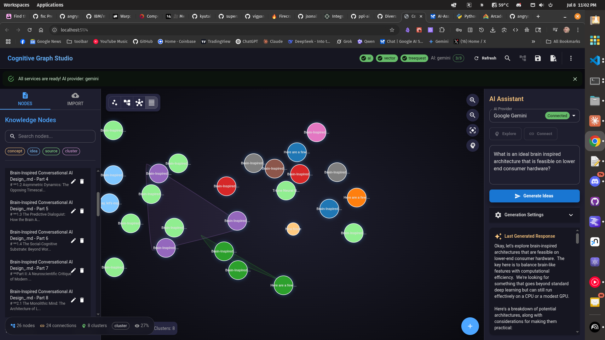

# Cognitive Graph Studio - Enhanced Version

[](https://www.typescriptlang.org/)
[](https://reactjs.org/)
[](https://vitejs.dev/)
[](https://mui.com/)
[](LICENSE)

> **AI-powered knowledge graph visualization with enhanced interactive capabilities**

## AI generated code- untested, use at own risk. Currently only partially functional to my specs.



❯ ./switch-to-enhanced.sh
🚀 Switching to Enhanced Cognitive Graph Studio...
✅ Enhanced version activated!

🎯 New Features:
  • AI can now read and understand your graph
  • Semantic document processing (no more 'brain inspired 1')
  • Network analysis with graph metrics
  • Intelligent connection suggestions
  • Enhanced AI interaction panel

📖 Quick Start:
  1. npm run dev
  2. Upload the demo-document.md file
  3. Ask AI: 'Analyze my current graph'
  4. Check the Analysis tab for network metrics

🔄 To revert: cp src/main.tsx.backup src/main.tsx


> *Architected following MVP Coding Agency standards with proper TypeScript conventions, clean separation of concerns, and comprehensive testability.*

### 🎨 **Enhanced Features**
- **Real-time service status monitoring** with visual indicators
- **Multiple AI provider support** (Gemini, LM Studio, Ollama)
- **Semantic clustering** with AI-powered connection suggestions
- **Responsive layout controls** (Force, Hierarchical, Circular, Cluster)
- **Enhanced error handling** with retry logic and fallback mechanisms

---

## 🚀 **Quick Start**

### **Prerequisites**
- Node.js 18+ (recommended: use `nvm` or `fnm`)
- npm or yarn package manager
- Git

### **Installation**

```bash
# Clone the repository
git clone <repository-url>
cd cognitive-graph-studio

# Install dependencies
npm install

# Copy environment template
cp .env.local.template .env.local

# Edit environment variables (see Configuration section)
nano .env.local

# Start development server
npm run dev
```

The application will be available at `http://localhost:5174`

---

## ⚙️ **Configuration**

### **Environment Setup**

1. **Copy the environment template:**
   ```bash
   cp .env.local.template .env.local
   ```

2. **Configure AI Services:**

   **Option 1: Google Gemini (Recommended)**
   ```env
   VITE_GEMINI_API_KEY=your_api_key_here
   ```
   Get your free API key from [Google AI Studio](https://aistudio.google.com/app/apikey)

   **Option 2: Local AI with LM Studio**
   ```env
   VITE_LMSTUDIO_BASE_URL=http://localhost:1234
   VITE_LMSTUDIO_MODEL=your_model_name
   ```
   Download from [LM Studio](https://lmstudio.ai/)

   **Option 3: Local AI with Ollama**
   ```env
   VITE_OLLAMA_BASE_URL=http://localhost:11434
   VITE_OLLAMA_MODEL=qwen2.5:latest
   ```
   Download from [Ollama](https://ollama.ai/)

3. **Vector Search Configuration:**
   ```env
   VITE_VECTOR_DIMENSIONS=768
   VITE_VECTOR_PERSISTENCE_ENABLED=true
   ```

---

## 🎮 **Usage Guide**

### **Graph Interactions**

#### **Creating Nodes**
- **Click on empty canvas** → Creates new node at cursor position
- **FAB button** → Creates node at center
- **Double-click node** → Opens node editor

#### **Graph Navigation**
- **Mouse wheel** → Zoom in/out
- **Drag background** → Pan around
- **Drag nodes** → Reposition nodes
- **Ctrl/Shift + click** → Multi-select nodes

#### **Layout Controls**
- **Force** → Physics-based natural layout
- **Hierarchical** → Tree-like vertical arrangement
- **Circular** → Radial distribution around center
- **Cluster** → AI-powered semantic grouping

### **AI-Powered Features**

#### **Connection Suggestions**
1. Click the **🧠 AI Suggestions** button
2. Review semantic connection recommendations
3. Accept suggestions to auto-create edges

#### **Content Generation**
1. Select nodes in left panel
2. Use AI Panel on right to generate:
   - Node descriptions
   - Relationship insights
   - Content summaries

---

## 🏗️ **Architecture**

### **Project Structure**
```
src/
├── components/          # React UI components
│   ├── GraphCanvasFixed.tsx    # Enhanced D3.js visualization
│   ├── NodePanel.tsx          # Node management interface
│   └── AIPanel.tsx            # AI service integration
├── services/           # Core business logic
│   ├── aiServiceFixed.ts      # Enhanced AI provider management
│   ├── service-manager-enhanced.ts  # Service coordination
│   └── vector-service.ts      # Semantic search engine
├── stores/            # State management
│   └── graphStore.ts         # Zustand-based graph state
├── types/             # TypeScript definitions
│   ├── graph.ts              # Graph data structures
│   └── ai.ts                 # AI service interfaces
└── utils/             # Helper functions
    ├── theme.ts              # Material UI theming
    └── semanticAnalysis.ts   # AI clustering algorithms
```

### **Core Components**

#### **GraphCanvasFixed** (`components/GraphCanvasFixed.tsx`)
Enhanced D3.js-based graph visualization with:
- **Stable force simulation** with optimized parameters
- **Proper zoom behavior** with event handling
- **Interactive node creation** via canvas clicks
- **Multiple layout algorithms** (force, hierarchical, circular, cluster)
- **Semantic clustering** with AI-powered grouping

#### **AIServiceFixed** (`services/aiServiceFixed.tsx`)
Robust AI service manager featuring:
- **Multiple provider support** (Gemini, LM Studio, Ollama)
- **Connection health monitoring** with automatic testing
- **Retry logic** with exponential backoff
- **Proper error handling** and status reporting
- **Rate limiting** and timeout management

#### **Service Manager** (`services/service-manager-enhanced.ts`)
Centralized service coordination:
- **Dependency injection** for testability
- **Status monitoring** with real-time updates
- **Service health checks** and recovery
- **Environment configuration** management

---

## 🧪 **Testing**

### **Run Tests**
```bash
# Unit tests
npm run test

# Watch mode during development
npm run test:watch

# Coverage report
npm run test:coverage
```

### **Testing Architecture**
- **Unit Tests** → Individual component/service testing
- **Integration Tests** → Service interaction testing
- **E2E Tests** → Full user workflow testing

All components are designed for testability following MVP Coding Agency standards.

---

## 🔧 **Development**

### **Build Commands**
```bash
# Development server
npm run dev

# Production build
npm run build

# Preview production build
npm run preview

# Type checking
npm run type-check

# Linting
npm run lint
```

### **Environment Variables**
See `.env.local.template` for comprehensive configuration options.

### **Code Standards**
- **TypeScript** strict mode enabled
- **ESLint** + **Prettier** for code formatting
- **TypeDoc-compatible** comments throughout
- **File-based module structure** for maintainability
- **Pure functions** where possible for testability

---

## 🚀 **Deployment**

### **Web Deployment**
```bash
npm run build
# Deploy 'dist/' directory to your hosting platform
```

### **Desktop App (Electron)**
```bash
npm run electron-build
# Generates platform-specific installers in 'dist-electron/'
```

### **Desktop App (Tauri)**
```bash
npm run tauri-build
# Generates native desktop applications
```

---

## 📋 **Troubleshooting**

### **Common Issues**

# Server left running ie starting on 5174
```bash
pkill -f "vite"
```

#### **Gemini API Connection Failed**
```bash
# Check API key configuration
echo $VITE_GEMINI_API_KEY

# Verify API access at Google AI Studio
# Ensure billing is enabled for higher rate limits
```

#### **Graph Not Responding**
```bash
# Check browser console for errors
# Verify D3.js dependencies are loaded
# Try refreshing with Ctrl+F5
```

#### **Local AI Not Working**
```bash
# For LM Studio: Ensure server is running on localhost:1234
# For Ollama: Check service status with 'ollama list'
```

### **Debug Mode**
Enable debug logging by setting:
```env
VITE_APP_DEBUG=true
```

---

## 🤝 **Contributing**

1. **Follow MVP Coding Agency standards**
2. **Maintain TypeScript strict mode**
3. **Add tests for new features**
4. **Update documentation**

### **Code Review Checklist**
- ✅ TypeScript interfaces defined
- ✅ Components are testable
- ✅ Error handling implemented
- ✅ Documentation updated
- ✅ Tests pass

---

## 📄 **License**

MIT License - see [LICENSE](LICENSE) file for details.

---

## 🙏 **Acknowledgments**

- **MVP Coding Agency** standards for architecture guidance
- **React + TypeScript** ecosystem
- **Material UI** for design system
- **D3.js** for graph visualization
- **Google Gemini** for AI capabilities

---

*Built with 💙 following angrysky56's MVP Coding Agency principles for maintainable, testable, and scalable TypeScript applications.*