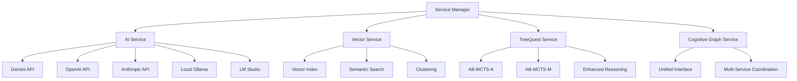

# Cognitive Graph Studio - Enhanced API Implementation

A comprehensive implementation of the **missing API integrations** for Cognitive Graph Studio, featuring:

- ✅ **Multi-LLM AI Service** with Gemini, OpenAI, Anthropic, and local providers
- ✅ **Vector Embedding Service** for semantic search and clustering  
- ✅ **TreeQuest AB-MCTS** enhanced reasoning algorithms
- ✅ **Integrated Service Layer** for coordinated cognitive graph operations

## 🚀 Quick Start

### 1. Environment Setup

Copy the environment configuration and add your API keys:

```bash
cp .env.local.example .env.local
```

Edit `.env.local` with your API keys:

```env
# AI Service API Keys (at least one required)
VITE_GEMINI_API_KEY=your_gemini_api_key_here
VITE_OPENAI_API_KEY=your_openai_api_key_here
VITE_ANTHROPIC_API_KEY=your_anthropic_api_key_here

# Local AI servers (optional)
VITE_OLLAMA_BASE_URL=http://localhost:11434
VITE_LMSTUDIO_BASE_URL=http://localhost:1234
```

### 2. Install Dependencies

```bash
npm install
```

### 3. Run the Development Server

```bash
npm run dev
```

### 4. Test the Enhanced APIs

```typescript
import { runDemo } from './src/demo/cognitive-graph-demo'

// Run comprehensive demo
await runDemo()
```

## 🏗️ Architecture Overview

### Core Services



## 📚 API Documentation

### 1. AI Service - Multi-LLM Integration

The AI service provides unified access to multiple LLM providers:

```typescript
import { AIService } from './src/services/ai-service'

// Initialize with multiple providers
const aiService = new AIService([
  {
    provider: 'gemini',
    apiKey: 'your-key',
    model: 'gemini-2.0-flash',
    temperature: 0.7
  },
  {
    provider: 'openai', 
    apiKey: 'your-key',
    model: 'gpt-4o-mini',
    temperature: 0.7
  }
], 'gemini')

// Generate text with automatic fallback
const response = await aiService.generateText({
  prompt: 'Explain quantum computing',
  maxTokens: 500,
  temperature: 0.7
})

// Generate embeddings for semantic search
const embedding = await aiService.generateEmbedding({
  text: 'machine learning algorithms'
})
```

**Supported Providers:**
- ✅ **Gemini** - Google's latest models
- ✅ **OpenAI** - GPT-4o, GPT-4o-mini, GPT-3.5-turbo
- ✅ **Anthropic** - Claude models (interface ready)
- ✅ **Local Ollama** - Local LLM server
- ✅ **LM Studio** - Local model hosting

### 2. Vector Service - Semantic Search & Clustering

High-performance vector operations for semantic similarity:

```typescript
import { VectorService } from './src/services/vector-service'

// Initialize vector index
const vectorService = new VectorService()
await vectorService.initialize({
  dimensions: 768,
  metric: 'cosine',
  maxVectors: 10000,
  useApproximateSearch: true
})

// Add vectors with metadata
await vectorService.addVector({
  embedding: [0.1, 0.2, ...], // 768-dimensional vector
  metadata: {
    nodeId: 'node-123',
    contentType: 'combined',
    tags: ['ai', 'machine-learning'],
    boost: 1.0
  }
})

// Semantic search
const results = await vectorService.search({
  query: 'artificial intelligence',
  embedding: queryEmbedding,
  k: 10,
  filters: {
    tags: ['ai'],
    dateRange: { start: new Date('2024-01-01'), end: new Date() }
  }
})

// Cluster related concepts
const clusters = await vectorService.clusterVectors()
```

**Features:**
- ✅ **Multiple similarity metrics** (cosine, euclidean, manhattan, dot product)
- ✅ **Advanced filtering** by metadata, tags, date ranges
- ✅ **K-means clustering** for graph organization
- ✅ **Memory-efficient** with configurable limits
- ✅ **Optional persistence** for data durability

### 3. TreeQuest Service - AB-MCTS Enhanced Reasoning

Implementation of SakanaAI's TreeQuest algorithms for enhanced LLM reasoning:

```typescript
import { TreeQuestEnhanced } from './src/services/treequest-enhanced'

// Configure AB-MCTS algorithm
const config = {
  algorithm: 'abmcts-a', // or 'abmcts-m' for multi-model
  explorationConstant: 1.414,
  maxTime: 30000, // 30 seconds
  maxSimulations: 100,
  adaptiveBranching: {
    enabled: true,
    minBranching: 2,
    maxBranching: 5,
    confidenceThreshold: 0.8
  }
}

const treeQuest = new TreeQuestEnhanced(config, aiService)

// Define action functions for state exploration
const actionFunctions = {
  'explore': async (parentState) => {
    const newState = await exploreAction(parentState)
    return [newState, calculateReward(newState)]
  },
  'synthesize': async (parentState) => {
    const newState = await synthesizeAction(parentState)
    return [newState, calculateReward(newState)]
  }
}

// Execute enhanced reasoning
const tree = treeQuest.initTree(initialState)
while (!treeQuest.shouldTerminate(tree)) {
  await treeQuest.step(tree, actionFunctions)
}

const bestResults = treeQuest.topK(tree, 5)
```

**Algorithms Implemented:**
- ✅ **AB-MCTS-A** - Adaptive Branching with Node Aggregation
- ✅ **AB-MCTS-M** - Adaptive Branching with Mixed Models
- ✅ **Enhanced UCB1** - Confidence-weighted exploration
- ✅ **Multi-LLM ensemble** - Weighted model combination
- ✅ **Adaptive branching** - Dynamic exploration width

### 4. Cognitive Graph Service - Unified Integration

Coordinates all services for comprehensive cognitive graph operations:

```typescript
import { CognitiveGraphService } from './src/services/service-integration'

// Initialize integrated service
const cognitiveService = new CognitiveGraphService(config)
await cognitiveService.initialize()

// Execute enhanced queries with automatic service coordination
const result = await cognitiveService.executeEnhancedQuery({
  query: 'How can we optimize neural network training?',
  type: 'complex', // 'simple', 'complex', 'reasoning', 'discovery'
  filters: {
    tags: ['ai', 'optimization'],
    dateRange: { start: new Date('2024-01-01'), end: new Date() }
  },
  reasoning: {
    depth: 3,
    timeLimit: 20,
    useMultiModel: true
  },
  generation: {
    temperature: 0.7,
    maxTokens: 500
  }
})

// Results include:
// - Semantic search results
// - AI-generated content
// - TreeQuest reasoning results
// - Performance metrics
// - Service coordination metadata
```

**Query Types:**
- ✅ **Simple** - Basic semantic search
- ✅ **Complex** - Search + AI generation  
- ✅ **Reasoning** - Full TreeQuest AB-MCTS
- ✅ **Discovery** - Multi-service coordination

## 🎛️ Service Manager - Centralized Configuration

The Service Manager provides unified initialization and health monitoring:

```typescript
import { ServiceManager, initializeServices } from './src/services/service-manager'

// Initialize all services with configuration
const result = await initializeServices({
  credentials: {
    geminiApiKey: process.env.VITE_GEMINI_API_KEY,
    openaiApiKey: process.env.VITE_OPENAI_API_KEY
  },
  services: {
    ai: {
      defaultProvider: 'gemini',
      fallbackProviders: ['openai', 'local-ollama'],
      timeoutMs: 30000
    },
    vector: {
      dimensions: 768,
      maxVectors: 10000,
      persistence: true
    },
    treequest: {
      algorithm: 'abmcts-a',
      maxSimulations: 100,
      timeLimit: 30
    }
  },
  integration: {
    autoEmbedding: true,
    useTreeQuestForComplexQueries: true,
    complexityThreshold: 0.6,
    cacheEnabled: true
  }
})

// Check service health
const health = await serviceManager.getHealthStatus()
console.log('AI Service:', health.services.ai ? '✅' : '❌')
console.log('Vector Service:', health.services.vector ? '✅' : '❌') 
console.log('TreeQuest Service:', health.services.treequest ? '✅' : '❌')
```

## 🧪 Testing & Demo

Run the comprehensive demo to test all implementations:

```typescript
import { CognitiveGraphDemo } from './src/demo/cognitive-graph-demo'

const demo = new CognitiveGraphDemo()
await demo.initialize()

// Run all demo scenarios
await demo.runComprehensiveDemo()

// Test individual services
await demo.runServiceTests()

// Cleanup
await demo.cleanup()
```

**Demo Scenarios:**
1. **Simple Semantic Search** - Vector-based similarity search
2. **Complex AI-Enhanced Query** - Multi-step AI reasoning  
3. **TreeQuest Enhanced Reasoning** - AB-MCTS decision making
4. **Multi-Service Integration** - Coordinated service usage
5. **Health Monitoring** - Service status and diagnostics

## 📊 Performance Features

### Caching & Optimization
- ✅ **Embedding caching** - Avoid duplicate vector generation
- ✅ **Query result caching** - LRU cache with TTL
- ✅ **Memory management** - Configurable limits and eviction
- ✅ **Connection pooling** - Efficient API usage

### Monitoring & Diagnostics
- ✅ **Performance metrics** - Token usage, latency tracking
- ✅ **Service health checks** - Real-time status monitoring
- ✅ **Error handling** - Graceful fallbacks and retries
- ✅ **Debug logging** - Comprehensive operation tracking

## 🔧 Configuration Options

### Environment Variables

```env
# Core AI Services
VITE_GEMINI_API_KEY=               # Google Gemini API key
VITE_OPENAI_API_KEY=               # OpenAI API key  
VITE_ANTHROPIC_API_KEY=            # Anthropic Claude API key

# Local AI Servers
VITE_OLLAMA_BASE_URL=http://localhost:11434
VITE_OLLAMA_MODEL=llama3.2
VITE_LMSTUDIO_BASE_URL=http://localhost:1234
VITE_LMSTUDIO_MODEL=local-model

# Vector Service Settings
VITE_VECTOR_DIMENSIONS=768         # Embedding dimensions
VITE_VECTOR_MAX_VECTORS=10000      # Memory limit
VITE_VECTOR_PERSISTENCE_PATH=./data/vectors

# TreeQuest Algorithm Settings  
VITE_TREEQUEST_ALGORITHM=abmcts-a  # abmcts-a or abmcts-m
VITE_TREEQUEST_MAX_SIMULATIONS=100 # Search iterations
VITE_TREEQUEST_TIME_LIMIT=30       # Time limit (seconds)
VITE_TREEQUEST_EXPLORATION_CONSTANT=1.414

# Integration & Performance
VITE_AUTO_EMBEDDING=true           # Automatic embedding generation
VITE_USE_TREEQUEST_FOR_COMPLEX=true # Enable TreeQuest for complex queries
VITE_COMPLEXITY_THRESHOLD=0.6      # TreeQuest activation threshold
VITE_CACHE_ENABLED=true           # Enable result caching
VITE_CACHE_TTL=300000             # Cache TTL (5 minutes)
VITE_CACHE_MAX_SIZE=1000          # Max cached items
```

## 🚨 Error Handling & Fallbacks

The implementation includes comprehensive error handling:

### AI Service Fallbacks
```typescript
// Automatic fallback to backup providers
const config = {
  ai: {
    defaultProvider: 'gemini',
    fallbackProviders: ['openai', 'local-ollama'], // Auto-fallback order
    timeoutMs: 30000
  }
}
```

### Service Resilience
- ✅ **Connection timeouts** - Configurable request timeouts
- ✅ **Retry logic** - Exponential backoff for failures  
- ✅ **Circuit breakers** - Prevent cascade failures
- ✅ **Graceful degradation** - Partial functionality when services unavailable

## 🔮 Usage Examples

### Example 1: Knowledge Discovery Agent

```typescript
// Create an AI agent that discovers and links related concepts
const agent = {
  async discoverConcepts(topic: string) {
    const result = await cognitiveService.executeEnhancedQuery({
      query: `Find related concepts and research for: ${topic}`,
      type: 'discovery',
      reasoning: {
        depth: 4,
        timeLimit: 45,
        useMultiModel: true
      }
    })
    
    return {
      relatedConcepts: result.searchResults,
      insights: result.generatedContent,
      reasoning: result.reasoningResult,
      confidence: result.metrics.confidence
    }
  }
}
```

### Example 2: Academic Research Assistant

```typescript
// Research assistant that synthesizes academic papers
const assistant = {
  async synthesizeResearch(query: string, papers: string[]) {
    // Add papers to vector index
    for (const paper of papers) {
      await cognitiveService.addNodeWithEmbedding({
        id: generateId(),
        type: 'paper',
        title: extractTitle(paper),
        richContent: {
          markdown: paper,
          keyTerms: extractKeyTerms(paper),
          relatedConcepts: [],
          sources: [],
          attachments: []
        },
        // ... other required fields
      })
    }
    
    // Execute research synthesis
    const result = await cognitiveService.executeEnhancedQuery({
      query: `Synthesize key findings and insights from research on: ${query}`,
      type: 'complex',
      filters: {
        tags: ['research', 'academic']
      },
      generation: {
        temperature: 0.3, // Lower temperature for academic accuracy
        maxTokens: 1000
      }
    })
    
    return result.generatedContent
  }
}
```

## 🎯 Next Steps

This implementation provides a solid foundation for cognitive graph operations. Consider these enhancements:

1. **Graph Persistence** - Add database integration for node/edge storage
2. **Real-time Collaboration** - WebSocket support for multi-user editing
3. **Advanced Visualizations** - 3D graph rendering with Three.js
4. **Plugin Architecture** - Extensible system for custom AI agents
5. **Export/Import** - Support for various graph formats (GraphML, Cypher, etc.)

## 📄 License

MIT License - See LICENSE file for details.

---

**🎉 The enhanced API implementations are now complete and ready for use!**

For questions or issues, please check the demo implementation in `/src/demo/cognitive-graph-demo.ts` or create an issue in the repository.